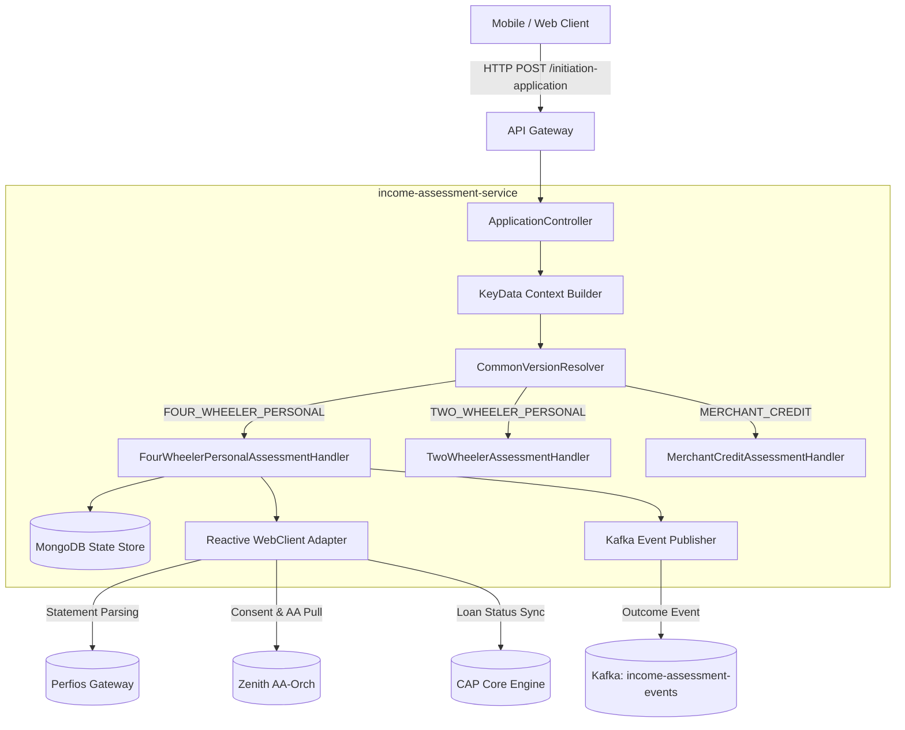

# Architecture Topology & Mermaid Diagrams

```mermaid
flowchart TD
    Client[Mobile / Web Client] -->|HTTP POST /initiation-application| Gateway[API Gateway]
    Gateway --> AC[ApplicationController]
    
    subgraph CoreService [income-assessment-service]
        AC --> KD[KeyData Context Builder]
        KD --> CVR[CommonVersionResolver]
        
        CVR -->|FOUR_WHEELER_PERSONAL| FWHandler[FourWheelerPersonalAssessmentHandler]
        CVR -->|TWO_WHEELER_PERSONAL| TWHandler[TwoWheelerAssessmentHandler]
        CVR -->|MERCHANT_CREDIT| MCCHandler[MerchantCreditAssessmentHandler]
        
        FWHandler --> Mongo[(MongoDB State Store)]
        FWHandler --> WebClient[Reactive WebClient Adapter]
        FWHandler --> KafkaPub[Kafka Event Publisher]
    end
    
    WebClient -->|Statement Parsing| Perfios[(Perfios Gateway)]
    WebClient -->|Consent & AA Pull| Zenith[(Zenith AA-Orch)]
    WebClient -->|Loan Status Sync| CAP[(CAP Core Engine)]
    KafkaPub -->|Outcome Event| Kafka[(Kafka: income-assessment-events)]
```
